https://blog.csdn.net/m0_68657832/article/details/137120385?ops_request_misc=%257B%2522request%255Fid%2522%253A%25226603416e6bbe90458cdaf4c5da05cf9c%2522%252C%2522scm%2522%253A%252220140713.130102334.pc%255Fblog.%2522%257D&request_id=6603416e6bbe90458cdaf4c5da05cf9c&biz_id=0&utm_medium=distribute.pc_search_result.none-task-blog-2~blog~first_rank_ecpm_v1~rank_v31_ecpm-1-137120385-null-null.nonecase&utm_term=git&spm=1018.2226.3001.4450
# 一、git的定义
git是一款分布式版本控制器软件。每台电脑都是一个对应的版本库，无需联网即可进行版本控制。多人协作只需要各自的修改推送给对方，就能互相看到对方的修改。

相对应的，SVN和CVS就是集中式版本控制器软件。需要联网才能获得最新版本，修改后需要提交到服务器。显然，git更加先进。

# 二、git的全貌图
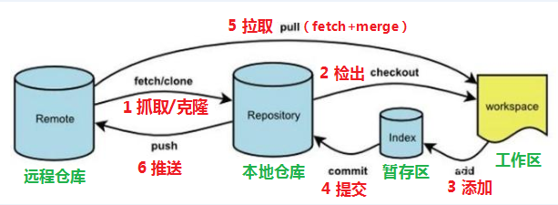
从这里我们可以看到，一共有四个区域，分别是：
1. `工作区`（Working Directory）
2. `暂存区`（Stage/Index）
3. `本地仓库`（Local Repository）
4. `远程仓库`（Remote Repository）
---

把这几个区域的关系转换搞清楚，那基本就可以万事大吉了！接下里的工作也基本是围绕这些进行的。

# 三、git的基本操作
## (一)安装与登录
安装就很简单，下载就好了，下载后，可以使用git bash终端进行操作。

安装后，`登录`是重头戏，需要配置`用户名`和`邮箱`。
我们知道，平时我们玩游戏时，为了区分不同玩家都需要进行登录。那么，显然在git中，我们也需要进行登录,用来区分唯一的用户。

### 1.登录的命令如下：

```
git config --global user.name "EthanYankang"
git config --global user.email "2126483838@qq.com"
```
如下:
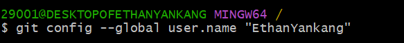
### 2.查看配置信息
```
git config --global user.name
git config --global user.email
```
如下：
 
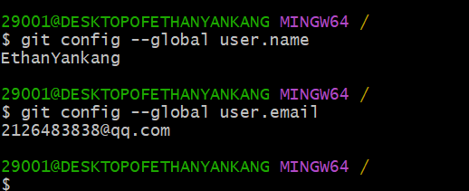

## (二)创建本地仓库
### 1.创建本地仓库
好了，前面的登录操作完成后，我们就可以创建本地仓库，正式进行操作了！
命令如下：
```
git init
```
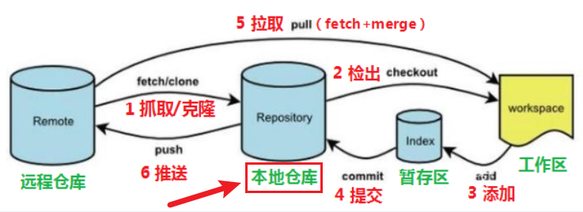

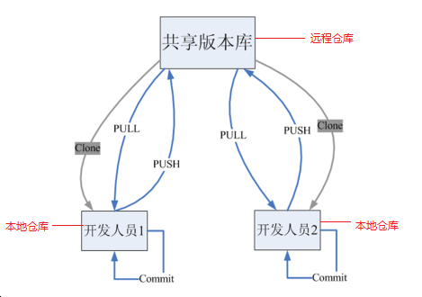
### 2.文件的状态
Git工作目录下对于文件的修改(增加、删除、更新)会存在几个状态，这些修改的状态会随着我们执行Git的命令而发生变化。

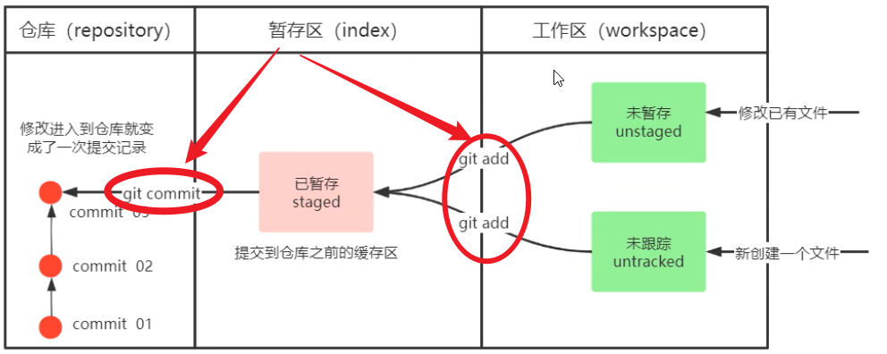

```
git add <file> //将文件从工作区添加到暂存区
git commit -m "提交信息" //将暂存区的文件提交到本地仓库
git status //查看文件的状态
```
#### 1.git add <file>
刚刚初始化后，查看文件状态
```
git status
```
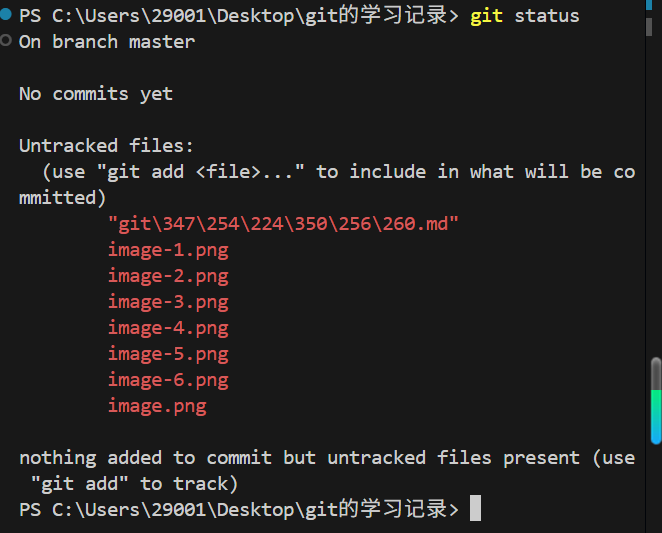
可以看到，这些文件都没有被跟踪，即仍然在工作区，还没有到暂存区。
下面使用git add命令将这些文件添加到暂存区
```
git add .//加入所有文件
```
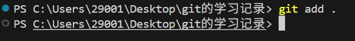
可以看到，这些文件都被添加到了`暂存区`。同时，文件的状态也被标上了`A`的标记。表示被`add`了。


#### 2.git status 查看提交到暂存区的文件
添加到了`暂存区`后，再次使用`git status`命令查看文件状态


准确的说，git status查看`当前工作区`和`暂存区`的文件状态

#### 3.git commit -m "提交信息"

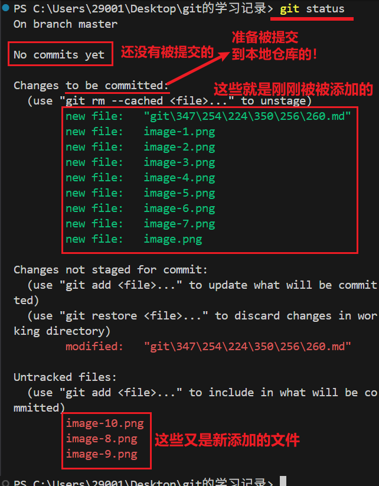

从这张刚刚被提交的图片来看，现在还没有commit的文件，即虽然暂存区里有了数据，但是本地仓库任然为空。

我们使用`git commit -m "提交信息"`命令将暂存区的文件提交到本地仓库。

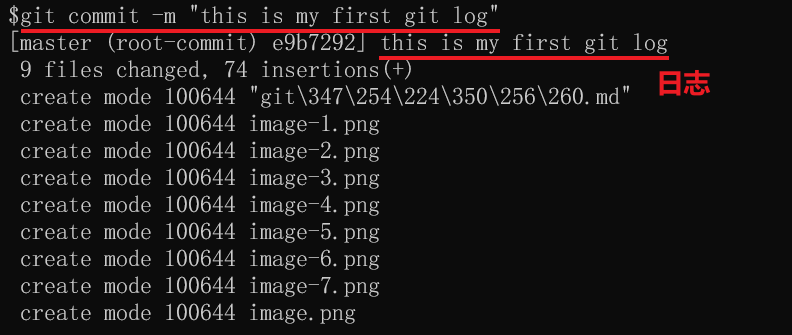

#### 4.git log 
提交了后，我们可以使用`git log`查看提交到本地仓库的文件！
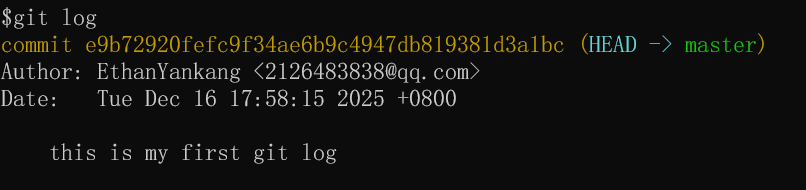

从这里可以看见，我们的提交信息及备注。


#### 4.git commit -a -m "对于已跟踪的无需git add,直接一键提交commit"
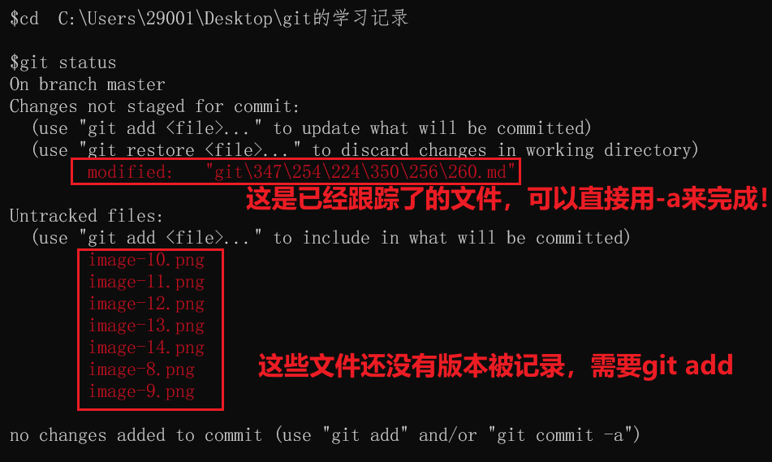

#### 5.撤回commit的提交
##### 软撤回
```
git reset --soft HEAD~1
```

`HEAD~1` 表示`「当前提交的上一个版本」`，也就是`撤回最近 1 次提交`；如果要撤回最近 2 次，就写 HEAD~2。
--soft：核心是`保留文件修改`，仅`撤销「提交」这个动作。`

---
演示


##### 硬撤回
`彻底删除这次提交，并且放弃这次提交的所有文件修改`（回到提交前的状态），用 git reset 的 --hard 选项。
```
# 彻底撤回最近1次提交，且清空所有修改
git reset --hard HEAD~1
```

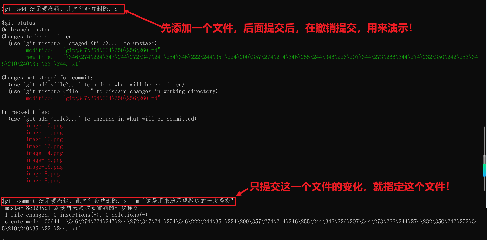

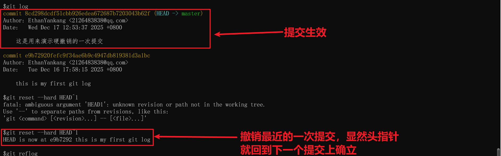
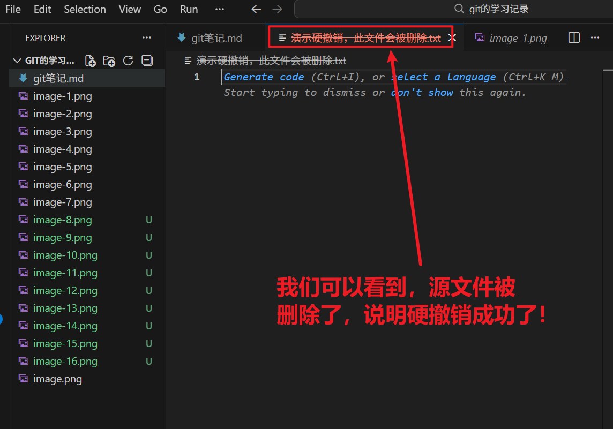


那么，我们撤销错了，可以取消吗？当然可以，如下：
```
Git 不会轻易彻底删除提交记录，哪怕是被 reset --hard 覆盖的提交，也能通过「提交哈希值」或「reflog」找回来，我会给你最直接、能 100% 恢复的方法。

核心原理：
git reset --hard 只是移动了当前分支的 HEAD 指针，并没有真正删除被跳过的提交对象，Git 会通过 reflog（引用日志）记录所有 HEAD 的移动历史，我们可以通过这个日志找到「执行 reset 前的提交哈希」，再切回去。
```
找到对应提交的哈希值
```
git reflog
```
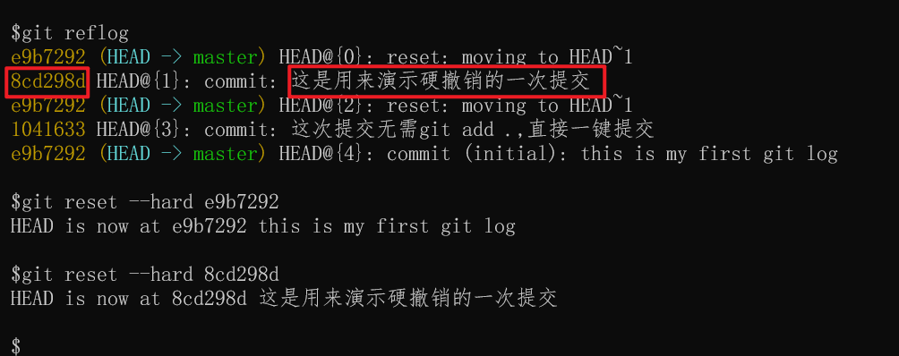

执行撤销这条命令：
```
git reset --hard 8cd298d 
```
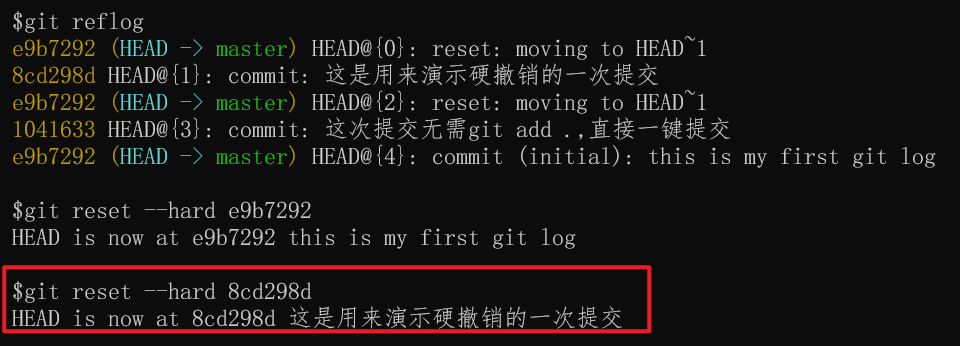

---

撤销撤销提交后，文件又回来了！

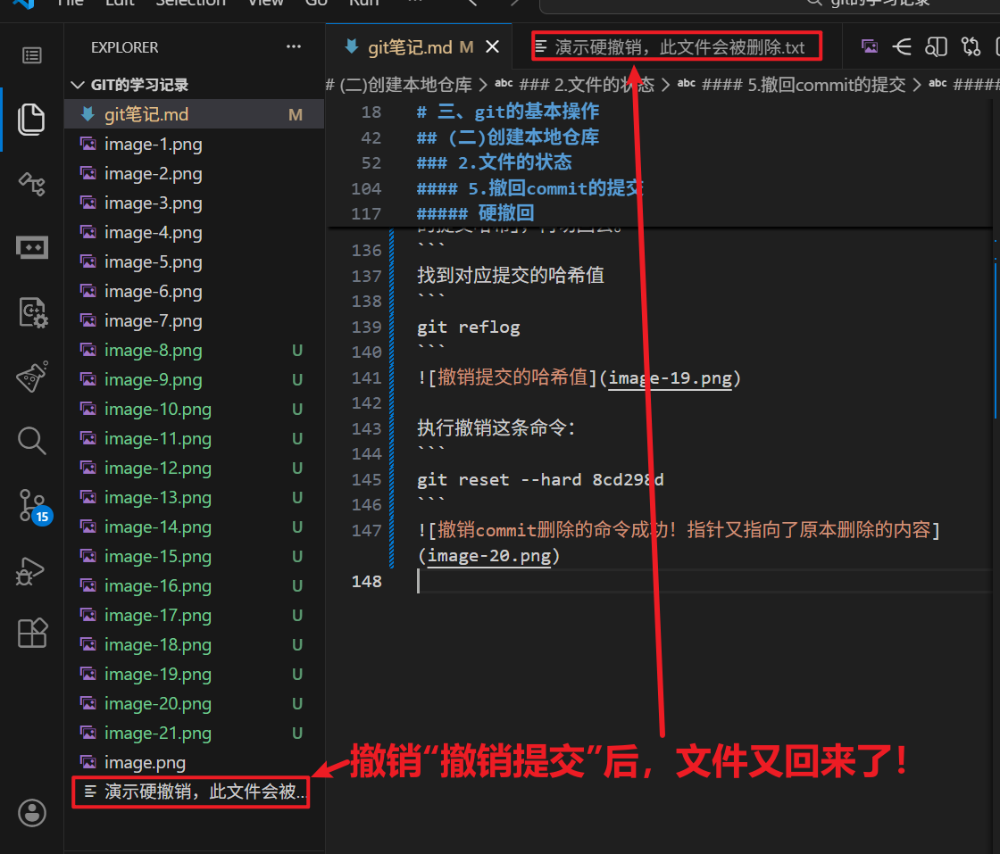

---

通过以上的流程，我们得知，所有的提交记录都被记录在`reflog`中，我们可以通过`reflog`找到所有的提交记录，包括被删除的提交记录。