https://blog.csdn.net/m0_68657832/article/details/137120385?ops_request_misc=%257B%2522request%255Fid%2522%253A%25226603416e6bbe90458cdaf4c5da05cf9c%2522%252C%2522scm%2522%253A%252220140713.130102334.pc%255Fblog.%2522%257D&request_id=6603416e6bbe90458cdaf4c5da05cf9c&biz_id=0&utm_medium=distribute.pc_search_result.none-task-blog-2~blog~first_rank_ecpm_v1~rank_v31_ecpm-1-137120385-null-null.nonecase&utm_term=git&spm=1018.2226.3001.4450
# 一、git的定义
git是一款分布式版本控制器软件。每台电脑都是一个对应的版本库，无需联网即可进行版本控制。多人协作只需要各自的修改推送给对方，就能互相看到对方的修改。

相对应的，SVN和CVS就是集中式版本控制器软件。需要联网才能获得最新版本，修改后需要提交到服务器。显然，git更加先进。

# 二、git的全貌图

从这里我们可以看到，一共有四个区域，分别是：
1. `工作区`（Working Directory）
2. `暂存区`（Stage/Index）
3. `本地仓库`（Local Repository）
4. `远程仓库`（Remote Repository）
---

把这几个区域的关系转换搞清楚，那基本就可以万事大吉了！接下里的工作也基本是围绕这些进行的。

# 三、git的基本操作
## (一)安装与登录
安装就很简单，下载就好了，下载后，可以使用git bash终端进行操作。

安装后，`登录`是重头戏，需要配置`用户名`和`邮箱`。
我们知道，平时我们玩游戏时，为了区分不同玩家都需要进行登录。那么，显然在git中，我们也需要进行登录,用来区分唯一的用户。

### 1.登录的命令如下：

```
git config --global user.name "EthanYankang"
git config --global user.email "2126483838@qq.com"
```
如下:

### 2.查看配置信息
```
git config --global user.name
git config --global user.email
```
如下：
 


## (二)创建本地仓库
### 1.创建本地仓库
好了，前面的登录操作完成后，我们就可以创建本地仓库，正式进行操作了！
命令如下：
```
git init
```


### 2.文件的状态
Git工作目录下对于文件的修改(增加、删除、更新)会存在几个状态，这些修改的状态会随着我们执行Git的命令而发生变化。


```
git add <file> //将文件从工作区添加到暂存区
git commit -m "提交信息" //将暂存区的文件提交到本地仓库
git status //查看文件的状态
```
#### 1.git add <file>
刚刚初始化后，查看文件状态
```
git status
```

可以看到，这些文件都没有被跟踪，即仍然在工作区，还没有到暂存区。
下面使用git add命令将这些文件添加到暂存区
```
git add .//加入所有文件
```

可以看到，这些文件都被添加到了`暂存区`。同时，文件的状态也被标上了`A`的标记。表示被`add`了。


#### 2.git status 查看提交到暂存区的文件
添加到了`暂存区`后，再次使用`git status`命令查看文件状态


准确的说，git status查看`当前工作区`和`暂存区`的文件状态

#### 3.git commit -m "提交信息"


从这张刚刚被提交的图片来看，现在还没有commit的文件，即虽然暂存区里有了数据，但是本地仓库任然为空。

我们使用`git commit -m "提交信息"`命令将暂存区的文件提交到本地仓库。


#### 4.git log 
提交了后，我们可以使用`git log`查看提交到本地仓库的文件！


从这里可以看见，我们的提交信息及备注。


#### 4.git commit -a -m "对于已跟踪的无需git add,直接一键提交commit"


#### 5.撤回commit的提交
##### 软撤回
```
git reset --soft HEAD~1
```

`HEAD~1` 表示`「当前提交的上一个版本」`，也就是`撤回最近 1 次提交`；如果要撤回最近 2 次，就写 HEAD~2。
--soft：核心是`保留文件修改`，仅`撤销「提交」这个动作。`

---
演示


##### 硬撤回
`彻底删除这次提交，并且放弃这次提交的所有文件修改`（回到提交前的状态），用 git reset 的 --hard 选项。
```
# 彻底撤回最近1次提交，且清空所有修改
git reset --hard HEAD~1
```


那么，我们撤销错了，可以取消吗？当然可以，如下：
```
Git 不会轻易彻底删除提交记录，哪怕是被 reset --hard 覆盖的提交，也能通过「提交哈希值」或「reflog」找回来，我会给你最直接、能 100% 恢复的方法。

核心原理：
git reset --hard 只是移动了当前分支的 HEAD 指针，并没有真正删除被跳过的提交对象，Git 会通过 reflog（引用日志）记录所有 HEAD 的移动历史，我们可以通过这个日志找到「执行 reset 前的提交哈希」，再切回去。
```
找到对应提交的哈希值
```
git reflog
```


执行撤销这条命令：
```
git reset --hard 8cd298d 
```


---

撤销撤销提交后，文件又回来了！


---

通过以上的流程，我们得知，所有的提交记录都被记录在`reflog`中，我们可以通过`reflog`找到所有的提交记录，包括被删除的提交记录。

---

### 3.git reflog和git reset的理解
通过以上，其实可以理解为，我们的git reflog是查看所有的提交记录，包括删除的，只要你操作了，所有的记录都可以在这里查看；
git reset --hard hash_value 可以理解为回退到某一个版本！


---
# 四、分支管理
## (一)基本知识
### 1.什么是git
- 先搞懂：Git 分支的本质（新手友好）

- Git 的分支不是`复制一份完整代码`（这是很多新手的误解），而是`一个轻量级的「指针」` —— `指向某次提交记录（commit）`。

- 默认分支通常叫 `main/master`，可以理解为「正式代码线」；

新建分支（比如 feature/login），只是**新建一个指针**，和 main 指向同一个提交，几乎不占磁盘空间；

- 分支上的修改，**只会移动当前分支的指针**，不会影响其他分支。

### 2.分支的比喻
用一个简单的比喻：
- 你在写一本书（main 分支），想加一个番外篇，不用直接在原书稿上改，而是复制一份「书签」（新建分支），在书签标记的位置开始写番外（开发功能）。写完后，要么把番外合并回原书（merge），要么放弃这个书签（删除分支），原书的内容全程不受影响。

### 2.为什么有git 
- 隔离开发，避免代码混乱

- 主分支（main）只保留可运行、可发布的稳定代码；

- 开发新功能（feature/xxx）、修复 Bug（bugfix/xxx）、发布版本（release/xxx）都在独立分支上进行，不会污染主分支。

## (二)分支命令
### 1.命令大全
```
git branch //查看本地分支
git branch name //创建本地分支
git checkout name //切换到name分支
git checkout -b name //创建并切换到name分支
git merge name //把name分支合并到当前分支
git branch -d b1 删除分支，并需要做各种检查
git branch -D b1 删除分支，并不做任何检查，强制删除
注意，不能删除当前分支，只能删除其他分支

```
### 2.创建分支
- git branch branch1 //创建分支branch1,但是不跳转
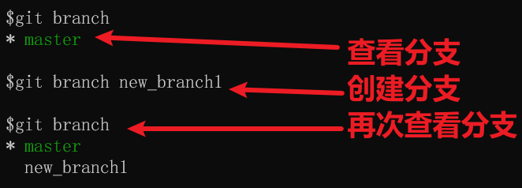

- git checkout -b feature/test  //创建分支feature/test,并跳转到此分支上去
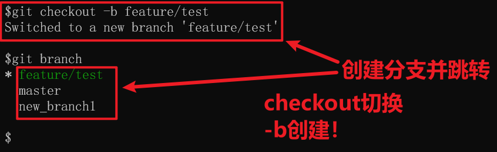
 
 
 只有新建了提交，新分支的提交才会显示出来


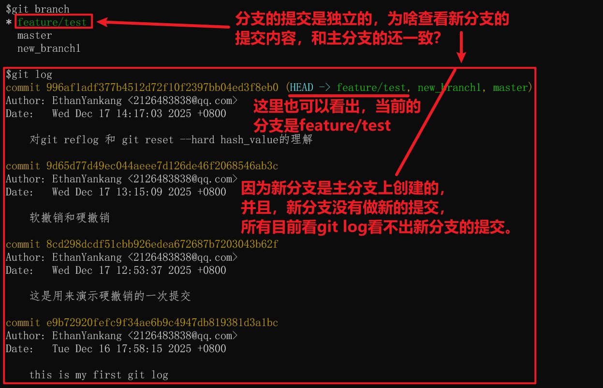


新分支提交了东西后，各分支区别就体现出来了！


最近的两个分支相互切换命令：`git checkout -`

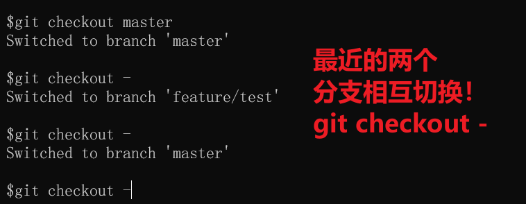

---

### 3.分支冲突解决

当合并的多个分支针对同一处内容进行不同的操作时，就会出现分支冲突，需要手动解决冲突。
总结来说，就是3句话：`先删标签，后编辑文件，最后提交。`
#### 演示
我们处于feature/test合并master分支时，出现一下报错：
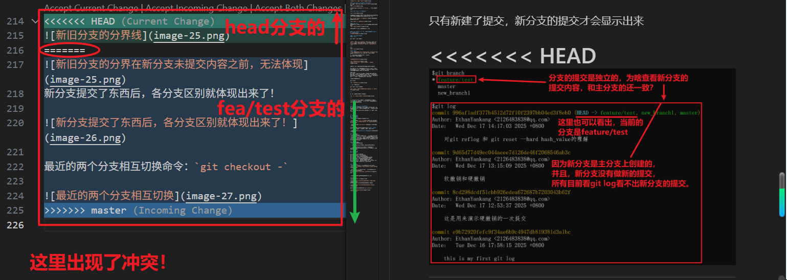

其中，《《《《《《HEAD和======之间的内容，是当前分支的修改，======和>>>>>>>之间的内容，是要合并的分支的修改。这是冲突的地方，现在要合并，究竟要保存哪一方的修改作为最后的结果？

我们在这里的选择是保存两者，即，删除所有标签(《《《《《《《=======》》》》》》》》)。

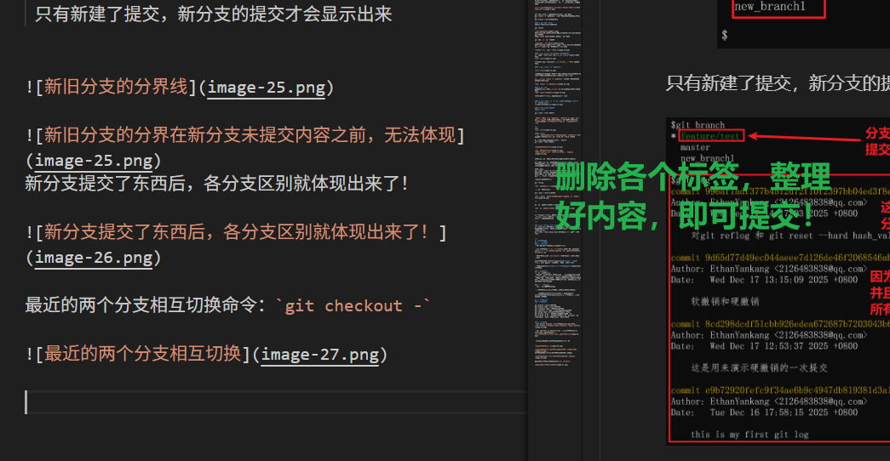

最后，我们还需要保存并提交当前的内容。即
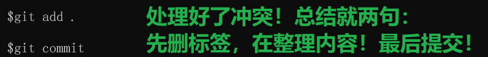

---

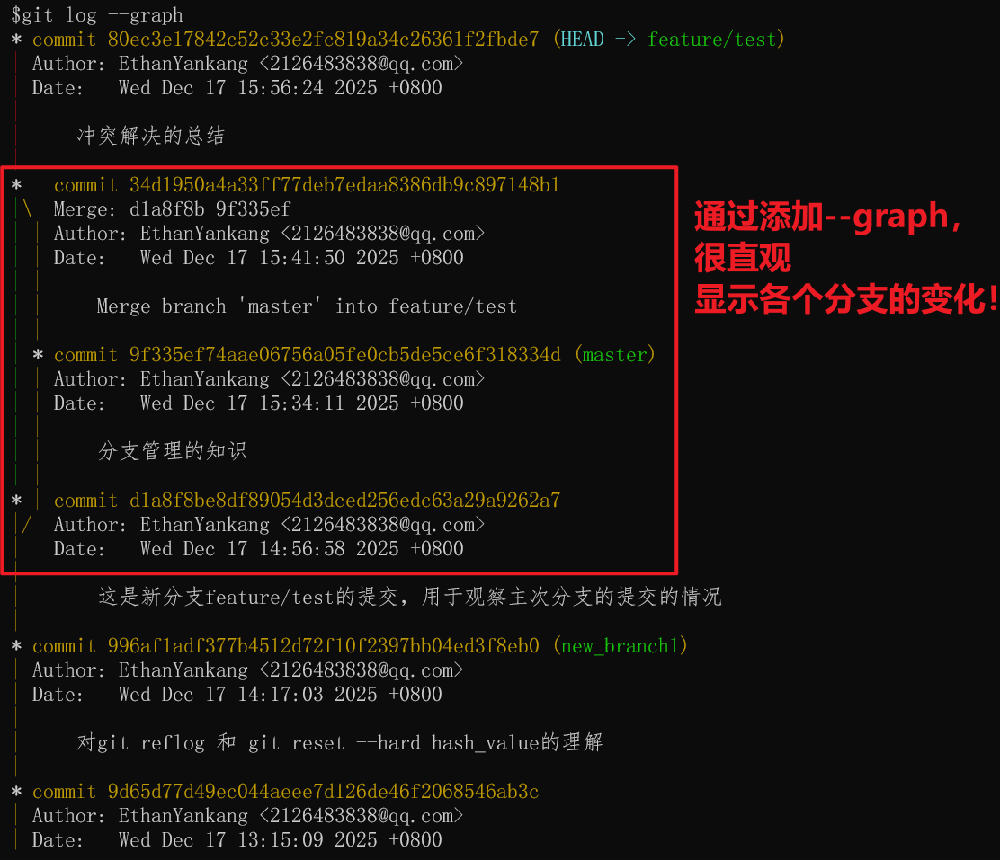

# 五、远程仓库
### 1.基础命令
```
git remote add origin https://github.com/ZYKWLJ/git-learn-record.git 

// 添加远程仓库(中央仓库)，所有与远程仓库有关的命令是git remote，add是子命令，而origin是远程仓库的名称，https://github.com/ZYKWLJ/git-learn-record.git是远程仓库的地址

git branch -M main // 把当前分支重命名为main(如果本身就是main则无需重命名)，因为一般默认命名为master分支，这是奴隶的意思，可能有种族歧视的含义，所以修改

git push -u origin main //git push提交到中央仓库的核心命令，-u：是 --set-upstream 的缩写，作用是把当前分支和远程分支关联起来，以后可以直接使用git push提交到远程分支，origin：要推送的远程仓库别名（对应之前 git remote add 关联的仓库）；main：要推送的本地分支名，同时远程会自动创建同名的 main 分支（如果不存在）。
```

### 2.添加远程仓库&&分支改名

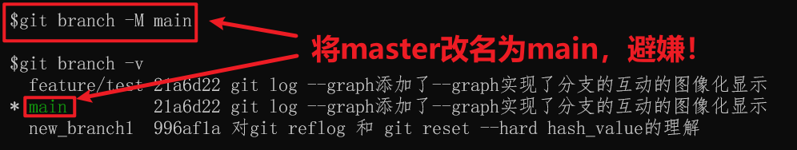

### 3.推送到远程仓库并与当前分支建立连接
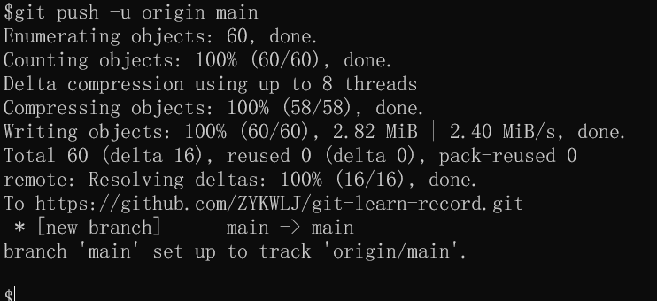

提交了后，远程仓库就有了内容了！
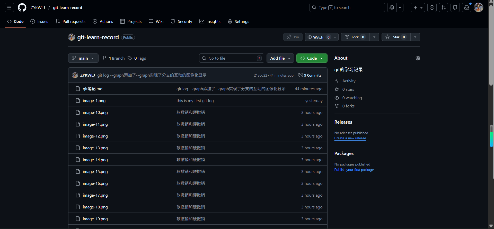

查看远程的分支，只有main分支，说明，我们从本地提交了分支后，远程仓库会自动创建分支并与之匹配

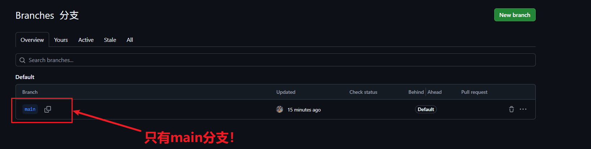

### 4.推送全部分支到远程仓库
目前，远程仓库也仅仅只有main分支，feature/test分支还在本地，没有推送到远程仓库。那如何提交全部本地分支到远程仓库呢?
使用命令：
```
git push origin --all
```
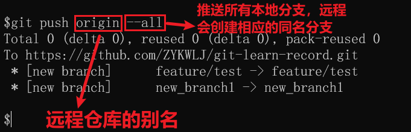

提交后，github侧有如下分支：
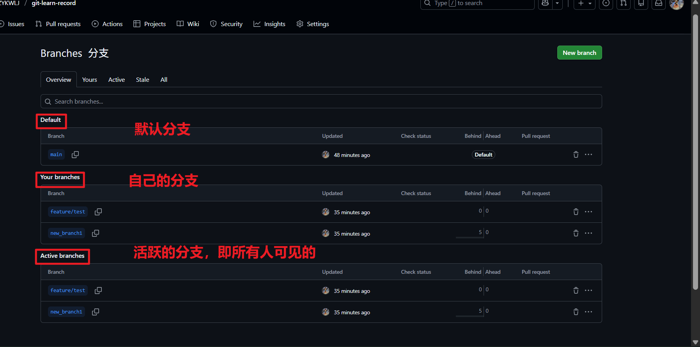

### 5.查看分支的3个命令
```
git branch //查看本地分支
git branch -v   //查看本地分支的详细信息
git branch -vv   //查看本地分支和远程分支的信息
git branch -avv //查看本地分支和远程分支的详细信息
```

#### 1.git branch //查看本地分支
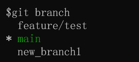

#### 2.git branch -v   //查看本地分支的详细信息
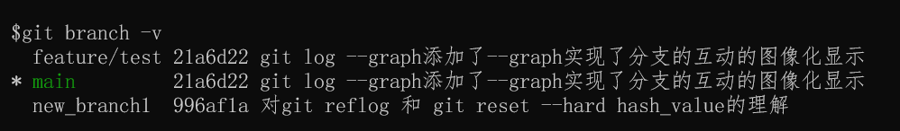

#### 3.git branch -vv   //查看本地分支和远程分支的信息
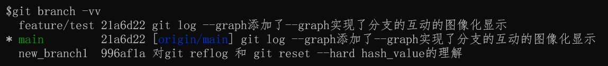


#### 4.git branch -avv //查看本地分支和远程分支的详细信息
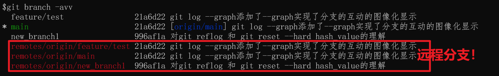